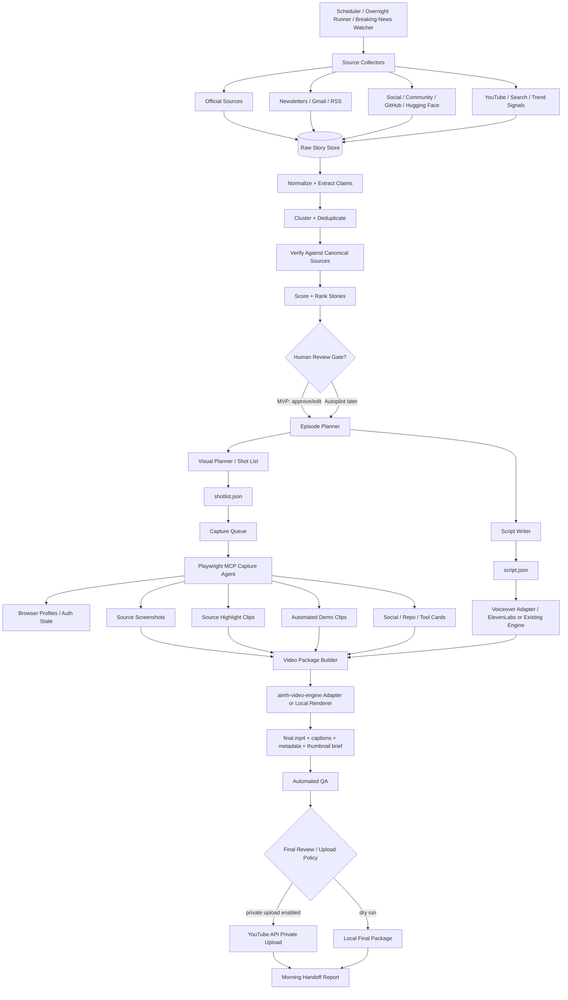

/goal
Build `aimh-newsroom` as a new, empty-repo project that becomes AIMH's autonomous AI newsroom: it discovers the day's AI news, verifies facts against canonical sources, ranks stories by freshness/trendiness/AIMH audience fit/demoability, writes a video-native episode script, creates a shot list, captures visual assets with Playwright MCP, renders or hands off the video package to `aimh-video-engine`, runs QA, and uploads the final video privately to YouTube when credentials are available. The system must run overnight without blocking on missing information: when it needs clarification, credentials, an unavailable API, or a design decision, it must choose a safe default, continue building/running what it can, persist progress, log the exact question or missing item for Denny, and resume automatically after any rate/usage limit resets. Denny will review the result on 2026-07-09 at 09:00 America/New_York local time.

---

# AIMH Newsroom Development Handoff

**Project name:** `aimh-newsroom`  
**Relationship to existing project:** separate repo/project, integrated with `aimh-video-engine` through a clean episode/video package contract.  
**Existing video engine local path:** `/Users/dennywii/Documents/dev/aimh-video-engine`  
**Existing engine note:** inspect that repo before implementing integrations. It may contain reusable code, environment variable names, ElevenLabs logic, FFmpeg logic, YouTube upload logic, branding assets, or pipeline conventions. There is an `.env` file in that folder that may contain configuration needed for integration. Never print or commit secrets from it.

---

## 1. One-sentence product definition

**AIMH Newsroom is an autonomous AI newsroom that turns the day's AI news into a fully produced YouTube video.**

Expanded version:

**AIMH Newsroom is an AI-powered pipeline that automatically discovers, verifies, ranks, scripts, visualizes, captures, packages, QA-checks, and publishes daily AI news videos with minimal human involvement.**

---

## 2. Core decision summary

| Decision | Final choice | Reasoning |
|---|---|---|
| Project structure | Create `aimh-newsroom` as a separate repo | The newsroom is domain/content intelligence; the video engine should remain reusable and domain-agnostic. |
| Relationship to `aimh-video-engine` | Peer project connected by an episode/video package contract | Keeps each system independently testable and allows future content engines to reuse the video engine. |
| Video approach | Video-native, not podcast-style | Every narration chunk must map to a visual: source proof, browser demo, card, trend graphic, comparison, social/use-case card, or takeaway. |
| Browser automation | Use Playwright MCP as the primary visual capture layer | Playwright MCP is the automated camera/operator for source pages, demos, screenshots, clips, and visual QA. |
| Rendering | Prefer reuse of `aimh-video-engine`; otherwise create a local renderer adapter | Existing code should be reused when practical, but development must not stop if integration details are missing. |
| Initial storage | Local-first filesystem + SQLite | Avoids blocking on cloud infrastructure and makes overnight development easier. Design adapters for Postgres/Supabase/S3/R2 later. |
| Human role in MVP | Human reviews selected stories, script/shot list, and final private upload | Early safety/quality gate while the automation proves itself. |
| Long-term target | Fully automated private upload; public release can remain manual initially | Private upload limits public mistakes while preserving end-to-end automation. |
| Content origin | AIMH's own verified/ranked story graph, not a single newsletter | Newsletters are discovery/context, official sources are truth, social/community sources provide demos/use cases, and trends prioritize urgency. |
| Overnight behavior | Never block waiting for the user | Use safe defaults, continue independent tasks, persist state, and produce a morning handoff. |
| Rate/usage limits | Treat as recoverable, not fatal | Parse reset headers when available, back off with jitter, checkpoint, continue other tasks, and resume automatically. |

---

## 3. Non-negotiable development rules

1. **Do not stop to ask Denny questions during overnight development.**  
   If information is missing, make a reasonable safe default, document it in `reports/questions-for-denny.md`, and continue.

2. **The repo starts empty.**  
   Scaffold it fully: package manager, scripts, source layout, tests, docs, `.env.example`, local state directories, fixtures, and sample episode.

3. **Inspect the existing local repo first.**  
   Read, but do not mutate without strong reason:

   ```bash
   /Users/dennywii/Documents/dev/aimh-video-engine
   ```

   Inspect at least:

   ```text
   package.json
   README / docs
   src/ or app/ folders
   scripts
   video pipeline commands
   YouTube upload code
   ElevenLabs code
   FFmpeg utilities
   schemas/types
   branding assets
   .env variable names only, never values
   ```

4. **Never print, commit, or expose secrets.**  
   `.env` values may be used locally, but reports must show only variable names and whether they are present/missing. Redact values as `***`.

5. **Build for autonomous continuation.**  
   Every step must checkpoint its state so a failed or rate-limited run can resume.

6. **Private upload only by default.**  
   Never publish publicly automatically. Use `privacyStatus=private` unless Denny explicitly changes the policy later.

7. **No single-source content dependency.**  
   Newsletters can discover stories, but factual claims must be verified against canonical/official or otherwise reliable sources.

8. **Every script paragraph needs a visual.**  
   If there is no visual, create one as a card/graphic, find proof/source footage, or cut the sentence.

9. **Prefer working end-to-end dry runs over incomplete perfection.**  
   If credentials are missing, produce a fixture-based demo video package and explain what credential unlocks the real integration.

10. **At 2026-07-09 09:00 America/New_York, Denny should be able to open the repo and see a clear status.**  
    The repo must contain a morning handoff report with what was built, what ran, what failed, what is mocked, and what information is needed.

---

## 4. Background reasoning and architecture decision

### Why `aimh-newsroom` should be separate from `aimh-video-engine`

`aimh-video-engine` should remain a generic video production engine. It should not know or care whether the content is AI news, cybersecurity news, tutorials, founder updates, product demos, or weekly summaries.

`aimh-newsroom` has a different responsibility. It is a content intelligence system. It discovers information, verifies it, ranks it, writes the episode, plans visuals, and captures source/demo assets.

The separation should look like this:

```text
AIMH Ecosystem
│
├── aimh-newsroom
│   ├── Discover stories
│   ├── Verify claims
│   ├── Rank stories
│   ├── Script episode
│   ├── Plan shots
│   ├── Capture source/demo visuals with Playwright MCP
│   └── Output episode package
│
├── aimh-video-engine
│   ├── Voice generation
│   ├── Timeline assembly
│   ├── Rendering
│   ├── FFmpeg polish
│   ├── Captions
│   ├── Branding
│   ├── QA
│   └── YouTube private upload
│
├── aimh-thumbnail-engine        # possible future project
├── aimh-distribution-engine     # possible future project
└── aimh-comment-engine          # possible future project
```

This enables future content projects to produce the same `episode.json` contract and reuse the video engine:

```text
aimh-newsroom              -> AI news videos
aimh-cybersecurity-weekly  -> cybersecurity videos
aimh-startup-weekly        -> startup/newsletter videos
aimh-product-updates       -> AIMH product videos
```

All of them can hand structured episodes to the same video engine.

---

## 5. High-level system diagram



---

## 6. Product workflow: what happens overnight

The overnight run should be a single command, for example:

```bash
pnpm newsroom:overnight
```

or:

```bash
pnpm run make-news-video -- --date today --mode overnight
```

The command should do the following:

1. **Initialize run state**
   - Create a run ID.
   - Create an episode folder.
   - Load `.env` from the new repo and inspect reusable variable names from `aimh-video-engine/.env`.
   - Validate tools: Node/Bun, FFmpeg, Playwright MCP, existing video engine path.
   - Write `reports/run-start.json`.

2. **Collect stories**
   - Pull official AI sources.
   - Pull configured newsletters when available.
   - Pull community/use-case sources when available.
   - Pull trend signals when available.
   - Store raw items as JSONL.

3. **Normalize and extract claims**
   - Convert each raw item into structured candidate story records.
   - Extract entities, dates, claims, URLs, source types, and evidence.

4. **Cluster/dedupe**
   - Group multiple reports about the same launch, model, feature, tool, or story.

5. **Verify**
   - Prefer official/canonical evidence.
   - Do not make hard factual claims based only on newsletters or social posts.
   - Label rumors, social demos, and unverified items clearly or skip them.

6. **Rank**
   - Score by freshness, credibility, trend velocity, YouTube opportunity, AIMH audience fit, demoability, novelty, and risk.

7. **Select episode**
   - Pick one main story.
   - Pick one practical use case/demo.
   - Pick one tool/model to watch.
   - Pick three to five quick hits.

8. **Generate script and shot list**
   - Produce video-native narration.
   - Map every narration chunk to one or more visuals.
   - Output `episode.json`, `script.json`, `shotlist.json`, `sources.json`, and `metadata.json`.

9. **Capture visuals with Playwright MCP**
   - Capture official source proof screenshots.
   - Capture source highlight clips.
   - Capture short automated browser demos when safe and credentials/auth are available.
   - Generate branded fallback cards when capture fails.

10. **Generate voice**
    - Reuse `aimh-video-engine` voice/ElevenLabs logic if available.
    - If not available, implement an adapter that can call ElevenLabs when env vars are present.
    - If no voice credentials, generate a placeholder manifest and continue.

11. **Render/package video**
    - Prefer calling/reusing `aimh-video-engine`.
    - If integration is unclear, produce a local video package and a minimal renderer/dry-run output.

12. **QA**
    - Check that each claim has a source.
    - Check that each segment has a visual.
    - Check no secret values appear in output.
    - Check final video exists if rendering is enabled.
    - Check metadata is valid.
    - Check upload is private.

13. **Upload privately if configured**
    - Upload to YouTube as private only if credentials exist and upload flag is enabled.
    - Otherwise, write the exact missing credential/config items.

14. **Write morning handoff**
    - Create `reports/morning-handoff-2026-07-09.md`.
    - Include commands run, artifacts produced, missing info, blocked integrations, and next recommended actions.

---

## 7. Source strategy

### Source hierarchy

| Layer | Purpose | Examples |
|---|---|---|
| Official/canonical sources | Truth layer for claims | OpenAI, Anthropic, Google Gemini/AI, Meta AI, Mistral, Hugging Face, GitHub/Copilot, Cursor, Replit |
| Newsletters | Discovery/context | The Rundown AI, Superhuman AI, The Batch, Best of AI if useful |
| Social/community | Use cases, demos, early reactions | X/Twitter curated lists, Reddit, Hacker News, GitHub, Hugging Face |
| Trend/search signals | Prioritization | Google Trends, YouTube Data API/search, GitHub stars/releases, Product Hunt if permitted |
| Broad news APIs | Backup discovery | GDELT, NewsAPI or equivalent if configured |

### Content principles

- **Official sources = truth.**
- **Newsletters = discovery/context.**
- **Social/community = use cases and velocity.**
- **Trend/search data = prioritization.**
- **AIMH's own verified story graph = the origin of the video.**

### Copyright and source-use rules

- Do not copy newsletter content verbatim into scripts.
- Do not scrape behind paywalls or bypass login/CAPTCHA protections.
- Use newsletters to discover a story, then verify with official/canonical sources.
- For social posts, use concise excerpts only when necessary and always preserve attribution/source URL in `sources.json`.
- Prefer generated AIMH cards over raw copied blocks of third-party text.
- Use official APIs where they are available and practical.

---

## 8. Ranking model

Implement a configurable scoring model. Initial formula:

```text
final_score =
  0.25 * freshness
+ 0.20 * trend_velocity
+ 0.20 * aimh_audience_fit
+ 0.15 * credibility
+ 0.10 * demoability
+ 0.10 * novelty
- 0.25 * risk_or_noise
- 0.10 * duplicate_coverage_penalty
```

### Score definitions

| Score | Meaning |
|---|---|
| `freshness` | How recently the story appeared or changed. |
| `trend_velocity` | Search/social/news momentum; high if mentions/searches are spiking. |
| `aimh_audience_fit` | Relevance to AIMH viewers: AI builders, operators, developers, creators, business users. |
| `credibility` | Official source or strong independent confirmation. |
| `demoability` | Can the story be shown visually through source page, UI demo, repo, workflow, or tool page? |
| `novelty` | Is this actually new, or a rehash? |
| `risk_or_noise` | Rumor risk, unclear claims, copyright risk, low-value hype, paid/sponsored ambiguity. |
| `duplicate_coverage_penalty` | Penalize stories already over-covered on YouTube unless the video can be faster or more useful. |

### Episode selection target

For a normal daily video:

```text
1 main story
1 practical use case/demo
1 tool or model to watch
3-5 quick hits
```

For a breaking-news video:

```text
1 major story
1 official source proof
1 practical implication
1 quick CTA
45-90 seconds preferred
```

---

## 9. Video-native format

This must not become a podcast. It should feel like an automated AI news reel.

### Daily video structure

```text
Cold open
  "Today in AI: [main story], [second story], and [tool/use case]."
  Visual: fast animated AIMH headline cards.

Segment 1: Main story
  Visual: official source page, highlighted text, summary card, comparison card.

Segment 2: Practical use case/demo
  Visual: browser demo, X/social card, GitHub repo, Hugging Face model page, generated workflow card.

Segment 3: Tool/model to watch
  Visual: landing page capture, feature card, repo/model card.

Segment 4: Fast hits
  Visual: quick branded cards with source proof thumbnails.

Final takeaway
  Visual: summary card + CTA.
```

### Visual rule

Every sentence or paragraph in the script must map to one of these shot types:

| Shot type | Purpose |
|---|---|
| `headline_card` | Branded intro or transition. |
| `source_screenshot` | Static proof from official page/docs/changelog. |
| `source_highlight_clip` | Browser clip showing a source page with highlighted text/scroll/zoom. |
| `browser_demo_clip` | Automated hands-on demo in a sandbox account or public tool. |
| `social_card` | Use-case/reaction card from X/Reddit/HN with attribution. |
| `repo_card` | GitHub repo/release/README/stars card. |
| `model_card` | Hugging Face/model release card. |
| `comparison_card` | OpenAI vs Anthropic vs Google etc. |
| `trend_card` | Trend/search/velocity visual. |
| `takeaway_card` | Final concise takeaway. |
| `cta_card` | Subscribe/follow call-to-action. |

If a sentence has no visual, generate a visual card or cut the sentence.

---

## 10. Playwright MCP role

Playwright MCP is the automated camera operator.

It should be used for:

- Opening official source pages.
- Finding relevant headings/text via accessibility snapshots.
- Capturing screenshots.
- Recording short browser clips.
- Highlighting text.
- Scrolling source pages.
- Capturing clean UI demos.
- Saving browser state for sandbox accounts.
- Checking pages loaded correctly.
- Validating no private account data is visible.

### MCP setup expectations

Use the official Playwright MCP server. Verify the current installation command from the docs during implementation. Current expected shape:

```json
{
  "mcpServers": {
    "playwright": {
      "command": "npx",
      "args": ["@playwright/mcp@latest"]
    }
  }
}
```

For the capture worker, enable only the capabilities needed. Current useful capabilities:

```text
core      -> navigation, snapshots, screenshots, typing/clicking
storage   -> saved auth state for sandbox accounts
devtools  -> video recording/tracing
network   -> debugging dynamic pages if needed
testing   -> asserting visible elements/text
```

Likely full capture config:

```bash
npx @playwright/mcp@latest --headless --caps=storage,devtools,network,testing
```

If headless rendering has problems, support a headed/debug mode:

```bash
npx @playwright/mcp@latest --port 8931 --caps=storage,devtools,network,testing
```

Then connect via:

```text
http://localhost:8931/mcp
```

### Safety rules for browser automation

- Use sandbox/demo accounts only.
- Do not use personal accounts for demos.
- Do not expose account menus, email addresses, API keys, dashboards, billing pages, or private projects.
- Add a redaction pass for screenshots/videos.
- Use allowlisted domains for automated captures.
- Do not bypass CAPTCHAs, paywalls, or anti-bot protections.
- Avoid arbitrary code execution tools unless explicitly needed and running in a trusted local environment.

### Allowlisted capture domains for MVP

Start with:

```text
openai.com
platform.openai.com
anthropic.com
docs.anthropic.com
blog.google
ai.google.dev
deepmind.google
github.com
huggingface.co
mistral.ai
ai.meta.com
cursor.com
replit.com
perplexity.ai
x.com
reddit.com
news.ycombinator.com
```

Allowlist should be configurable.

---

## 11. Episode package contract

The key integration between `aimh-newsroom` and `aimh-video-engine` is a portable episode package.

### Folder shape

```text
episodes/
  2026-07-09-daily-ai-briefing/
    raw_items.jsonl
    clusters.json
    rankings.json
    episode.json
    script.json
    shotlist.json
    sources.json
    metadata.json
    qa.json
    assets/
      screenshots/
      clips/
      cards/
      thumbnails/
    voice/
      narration.mp3
      narration.json
    render/
      final.mp4
      captions.srt
    reports/
      questions-for-denny.md
      run-log.md
      rate-limits.json
```

### `episode.json` high-level schema

```json
{
  "schema_version": "0.1.0",
  "episode_id": "2026-07-09-daily-ai-briefing",
  "date": "2026-07-09",
  "timezone": "America/New_York",
  "title": "Today in AI: ...",
  "description": "...",
  "format": "daily_ai_briefing",
  "target_duration_seconds": 240,
  "status": "planned|capturing|rendering|qa|ready|uploaded_private|needs_review",
  "segments": [],
  "youtube": {},
  "sources_file": "sources.json",
  "script_file": "script.json",
  "shotlist_file": "shotlist.json",
  "metadata_file": "metadata.json"
}
```

### `script.json` high-level schema

```json
{
  "schema_version": "0.1.0",
  "voice": {
    "provider": "elevenlabs",
    "voice_id_env": "ELEVENLABS_VOICE_ID",
    "style": "clear, fast, useful, confident"
  },
  "narration": [
    {
      "id": "seg_001_para_001",
      "segment_id": "seg_001",
      "text": "Today in AI, OpenAI released...",
      "estimated_seconds": 7,
      "claim_ids": ["claim_001"],
      "shot_ids": ["shot_001", "shot_002"]
    }
  ]
}
```

### `shotlist.json` high-level schema

```json
{
  "schema_version": "0.1.0",
  "shots": [
    {
      "id": "shot_001",
      "segment_id": "seg_001",
      "type": "source_highlight_clip",
      "duration_seconds": 7,
      "source_url": "https://example.com/official-announcement",
      "highlight_text": "new model",
      "fallback": {
        "type": "source_screenshot",
        "card_text": "Official announcement: new model"
      },
      "asset_path": null,
      "status": "planned|captured|failed|fallback_generated"
    }
  ]
}
```

### `sources.json` high-level schema

```json
{
  "schema_version": "0.1.0",
  "claims": [
    {
      "id": "claim_001",
      "text": "Company X announced feature Y on date Z.",
      "source_ids": ["source_001"],
      "verification_status": "verified|partially_verified|unverified|rejected",
      "risk_notes": []
    }
  ],
  "sources": [
    {
      "id": "source_001",
      "url": "https://example.com/official-announcement",
      "title": "Official announcement title",
      "publisher": "Company X",
      "source_type": "official|newsletter|social|repo|news|trend|other",
      "published_at": "2026-07-09T08:00:00-04:00",
      "accessed_at": "2026-07-09T08:30:00-04:00"
    }
  ]
}
```

### `metadata.json` high-level schema

```json
{
  "schema_version": "0.1.0",
  "youtube": {
    "title": "...",
    "description": "...",
    "tags": ["AI news", "OpenAI", "Claude", "Gemini"],
    "categoryId": "28",
    "privacyStatus": "private",
    "madeForKids": false,
    "containsSyntheticMedia": true
  },
  "thumbnail": {
    "brief": "Big bold AI news thumbnail with main model/logo references and AIMH branding",
    "text_options": ["AI Just Changed", "Big AI Update", "Today in AI"]
  }
}
```

---

## 12. Integration with `aimh-video-engine`

### Existing engine path

```text
/Users/dennywii/Documents/dev/aimh-video-engine
```

### Required inspection tasks

The implementation agent should inspect the existing repo and answer internally:

1. What package manager does it use?
2. What language/framework does it use?
3. What commands exist for video generation/rendering?
4. What is the expected input format?
5. Does it already support `script.json`, `metadata.json`, `recording.mp4`, `.srt`, Tella exports, ElevenLabs, FFmpeg, YouTube upload, or QA helpers?
6. Which components can be reused as a library?
7. Which components need a CLI adapter?
8. Which `.env` variable names are already defined?
9. Can `aimh-newsroom` call the engine as a child process?
10. Should any shared code be copied into a local adapter or kept as a path dependency?

### Preferred integration strategy

1. **Do not tightly couple repos.**
2. Add a thin adapter in `aimh-newsroom`, for example:

```text
src/integrations/video-engine/
  detectVideoEngine.ts
  loadVideoEngineEnv.ts
  buildVideoEngineInput.ts
  runVideoEngine.ts
  parseVideoEngineOutput.ts
```

3. The adapter should support these modes:

| Mode | Behavior |
|---|---|
| `detected_cli` | Call existing video engine CLI if a compatible command exists. |
| `detected_library` | Import/use local package if supported. |
| `package_only` | Produce a complete episode package for later rendering. |
| `local_fallback_render` | Render a minimal video locally if the engine cannot be called. |

4. If engine integration is unclear, continue with `package_only` plus `local_fallback_render` if feasible.

### Do not mutate existing engine unless necessary

If changes are needed in `aimh-video-engine`, write them to:

```text
reports/video-engine-integration-requests.md
```

Include:

```text
- What needs to change
- Why
- Proposed interface
- Files likely affected
- Whether it blocks this repo
- Workaround used overnight
```

---

## 13. Environment and secrets policy

### Env loading order

Use this loading policy:

1. Shell environment.
2. `aimh-newsroom/.env`.
3. `/Users/dennywii/Documents/dev/aimh-video-engine/.env` as a fallback source for variable names/values needed by shared integrations.

If there is a conflict, prefer the new repo's `.env` for newsroom-specific behavior, but preserve compatibility with the video engine.

### Redaction requirements

All logs and reports must redact secrets:

```text
OPENAI_API_KEY=present
ELEVENLABS_API_KEY=present
YOUTUBE_REFRESH_TOKEN=missing
```

Never output:

```text
OPENAI_API_KEY=sk-...
```

### Candidate env vars to support

Create `.env.example` with optional groups:

```bash
# General
NODE_ENV=development
AIMH_TIMEZONE=America/New_York
AIMH_BRAND_NAME=AIMH
AIMH_VIDEO_ENGINE_PATH=/Users/dennywii/Documents/dev/aimh-video-engine

# LLM provider - support whichever is present
OPENAI_API_KEY=
ANTHROPIC_API_KEY=
GOOGLE_API_KEY=
AIMH_LLM_PROVIDER=openai
AIMH_LLM_MODEL=

# ElevenLabs / voice
ELEVENLABS_API_KEY=
ELEVENLABS_VOICE_ID=
ELEVENLABS_MODEL_ID=

# YouTube
YOUTUBE_CLIENT_ID=
YOUTUBE_CLIENT_SECRET=
YOUTUBE_REFRESH_TOKEN=
YOUTUBE_CHANNEL_ID=
YOUTUBE_UPLOAD_ENABLED=false
YOUTUBE_DEFAULT_PRIVACY_STATUS=private

# Gmail/newsletters, optional
GOOGLE_CLIENT_ID=
GOOGLE_CLIENT_SECRET=
GOOGLE_REFRESH_TOKEN=
GMAIL_NEWSLETTER_LABEL=

# X/Twitter, optional
X_API_KEY=
X_API_SECRET=
X_BEARER_TOKEN=
X_ACCESS_TOKEN=
X_ACCESS_TOKEN_SECRET=

# News/trends, optional
NEWS_API_KEY=
GDELT_ENABLED=true
GOOGLE_TRENDS_ENABLED=true
YOUTUBE_TRENDS_ENABLED=true

# Playwright MCP
PLAYWRIGHT_MCP_URL=http://localhost:8931/mcp
PLAYWRIGHT_MCP_HEADLESS=true
PLAYWRIGHT_MCP_CAPS=storage,devtools,network,testing
PLAYWRIGHT_USER_DATA_DIR=.state/playwright-profile

# Rendering
FFMPEG_PATH=ffmpeg
AIMH_RENDER_MODE=auto
AIMH_LOCAL_FALLBACK_RENDER=true

# Overnight behavior
AIMH_OVERNIGHT_MODE=true
AIMH_NEVER_BLOCK=true
AIMH_RESUME_AFTER_RATE_LIMIT=true
AIMH_MORNING_REVIEW_AT=2026-07-09T09:00:00-04:00
```

Adjust names after inspecting the existing engine.

---

## 14. Rate limits, failures, and continuation design

The pipeline must not fail the entire run because one API or source fails.

### Required rate-limit behavior

If a request receives a rate limit or usage limit response:

1. Parse `Retry-After`, `X-RateLimit-Reset`, provider-specific reset headers, or response body reset time if available.
2. Store the task as `rate_limited` with `resume_at`.
3. Continue other independent tasks.
4. Retry after reset time.
5. If no reset time exists, use exponential backoff with jitter.
6. Write to `reports/rate-limits.json`.
7. Do not mark the whole pipeline failed unless all critical paths are impossible and fallbacks cannot run.

### Required checkpoint behavior

Every task must save status:

```json
{
  "run_id": "run_2026_07_09_overnight",
  "task_id": "capture_shot_003",
  "status": "queued|running|succeeded|failed|rate_limited|skipped|fallback_used",
  "started_at": "...",
  "finished_at": "...",
  "resume_at": "...",
  "attempts": 2,
  "error_redacted": "...",
  "fallback_used": true
}
```

Store in SQLite and/or JSONL under:

```text
.state/jobs.sqlite
episodes/<episode_id>/reports/run-events.jsonl
```

### Missing information behavior

If missing a required decision or credential:

```text
1. Use safe default.
2. Continue.
3. Add exact item to reports/questions-for-denny.md.
4. Include impact and how to resolve.
```

Question format:

```markdown
## Question 003: YouTube refresh token missing

- Needed for: private YouTube upload
- Default used overnight: skipped upload, produced local final package
- Impact: video can be reviewed locally but was not uploaded
- To resolve: add `YOUTUBE_REFRESH_TOKEN` to `.env`
- Pipeline command to resume: `pnpm newsroom:upload --episode 2026-07-09-daily-ai-briefing`
```

### LLM/tool usage limits

If the development agent itself risks hitting tool/model usage limits:

1. Write `CHECKPOINT.md` with current state.
2. Commit or save all files produced so far.
3. Write the exact resume command.
4. Ensure the code-level pipeline can continue after external API limits reset.

---

## 15. Human-in-the-loop design

### MVP review gates

The initial system can require Denny to review:

1. Selected stories.
2. Generated script and shot list.
3. Final private YouTube upload or local video package.

But the overnight development process must not wait for those approvals. Use default auto-approval in `overnight` mode and write review artifacts.

### Review artifacts

Generate:

```text
episodes/<episode_id>/review.html
episodes/<episode_id>/episode-review.md
episodes/<episode_id>/reports/questions-for-denny.md
```

The review page should show:

- Selected stories.
- Why each story was selected.
- Source URLs.
- Claims and verification status.
- Script.
- Shot list.
- Assets captured.
- QA status.
- Upload status.
- Buttons/commands or instructions for rerender/reupload if a UI is built later.

### Plain-English adjustment loop

Design for later:

```text
"Replace story 2 with the Gemini update."
"Make this more technical."
"Remove the X post."
"Shorten to 90 seconds."
"Regenerate the thumbnail."
```

The system should invalidate only affected downstream artifacts and rerun from the correct stage.

---

## 16. Suggested repo structure

```text
aimh-newsroom/
  README.md
  package.json
  tsconfig.json
  .env.example
  .gitignore

  docs/
    architecture.md
    episode-spec.md
    source-policy.md
    overnight-runbook.md
    video-engine-integration.md

  src/
    cli/
      index.ts
      commands/
        collect.ts
        rank.ts
        plan.ts
        capture.ts
        voice.ts
        render.ts
        qa.ts
        upload.ts
        overnight.ts
        resume.ts

    config/
      env.ts
      paths.ts
      sourceConfig.ts
      allowlist.ts

    state/
      jobStore.ts
      checkpoint.ts
      rateLimitStore.ts

    collectors/
      types.ts
      official/
        openai.ts
        anthropic.ts
        google.ts
        meta.ts
        mistral.ts
        huggingface.ts
      newsletters/
        rundown.ts
        superhuman.ts
        batch.ts
        gmail.ts
      community/
        github.ts
        hackernews.ts
        reddit.ts
        x.ts
      trends/
        youtube.ts
        googleTrends.ts
        gdelt.ts
      fixtures/
        fixtureCollector.ts

    normalize/
      normalizeItem.ts
      extractClaims.ts
      extractEntities.ts
      clusterStories.ts
      dedupe.ts

    verify/
      verifyClaims.ts
      canonicalSourceRules.ts
      sourceCredibility.ts

    rank/
      scoreStory.ts
      selectEpisode.ts

    plan/
      writeScript.ts
      createShotlist.ts
      createMetadata.ts
      episodeBuilder.ts

    capture/
      mcp/
        mcpClient.ts
        playwrightMcpServer.ts
        tools.ts
      captureSourceScreenshot.ts
      captureSourceHighlightClip.ts
      captureBrowserDemo.ts
      captureSocialCard.ts
      captureRepoCard.ts
      generateFallbackCard.ts
      redactAssets.ts

    voice/
      voiceAdapter.ts
      elevenLabsAdapter.ts
      videoEngineVoiceAdapter.ts
      placeholderVoiceAdapter.ts

    render/
      videoPackageBuilder.ts
      videoEngineAdapter.ts
      localFallbackRenderer.ts
      remotionAdapter.ts
      ffmpegAdapter.ts

    upload/
      youtubeAdapter.ts
      dryRunUploader.ts

    qa/
      claimCoverageCheck.ts
      visualCoverageCheck.ts
      secretLeakCheck.ts
      assetExistenceCheck.ts
      videoMetadataCheck.ts
      privateUploadCheck.ts
      qaRunner.ts

    reports/
      morningHandoff.ts
      questionsForDenny.ts
      runLog.ts

    schemas/
      episode.schema.json
      script.schema.json
      shotlist.schema.json
      sources.schema.json
      metadata.schema.json

    utils/
      logger.ts
      redact.ts
      retry.ts
      time.ts
      safeFetch.ts
      hash.ts

  episodes/
    .gitkeep

  fixtures/
    sample-raw-items.jsonl
    sample-episode.json

  tests/
    unit/
    integration/
    fixtures/
```

---

## 17. CLI requirements

Implement scripts similar to:

```json
{
  "scripts": {
    "newsroom:collect": "tsx src/cli/index.ts collect",
    "newsroom:rank": "tsx src/cli/index.ts rank",
    "newsroom:plan": "tsx src/cli/index.ts plan",
    "newsroom:capture": "tsx src/cli/index.ts capture",
    "newsroom:voice": "tsx src/cli/index.ts voice",
    "newsroom:render": "tsx src/cli/index.ts render",
    "newsroom:qa": "tsx src/cli/index.ts qa",
    "newsroom:upload": "tsx src/cli/index.ts upload",
    "newsroom:overnight": "tsx src/cli/index.ts overnight",
    "newsroom:resume": "tsx src/cli/index.ts resume",
    "newsroom:dry-run": "tsx src/cli/index.ts overnight --dry-run --fixtures"
  }
}
```

Commands should accept:

```bash
--date 2026-07-09
--episode 2026-07-09-daily-ai-briefing
--mode overnight|review|autopilot|dry-run
--from-stage collect|rank|plan|capture|voice|render|qa|upload
--to-stage collect|rank|plan|capture|voice|render|qa|upload
--fixtures
--no-upload
--private
--resume
```

---

## 18. MVP scope for first overnight build

Do not try to build every integration perfectly. Build a functioning spine first.

### Must build

- Project scaffold.
- Env/secrets loader with redaction.
- Existing engine detector/inspector.
- Episode package schema.
- Job/checkpoint state.
- Source collector interfaces.
- At least one real official-source collector if practical.
- Fixture collector so the pipeline can run without network/API credentials.
- Story normalization/clustering/ranking skeleton.
- Script generator using available LLM provider or deterministic fixture fallback.
- Shot list generator.
- Playwright MCP adapter skeleton.
- At least screenshot capture if MCP is available.
- Fallback card generator if capture fails.
- Video engine adapter skeleton.
- Local package-only output if rendering cannot complete.
- QA runner.
- Morning handoff report.
- Tests for core schemas, ranking, redaction, and non-blocking missing env behavior.

### Nice to build if time allows

- Remotion/local fallback renderer.
- ElevenLabs direct adapter.
- YouTube private upload adapter.
- HTML review page.
- GitHub/Hugging Face collectors.
- Hacker News collector.
- Basic YouTube trend search.
- Breaking-news watcher.

### Explicitly defer unless easy

- Full X/Twitter API integration.
- Advanced Google Trends scraping/API workaround.
- Complex live ChatGPT/Claude/Gemini logged-in demos.
- Auto-public publishing.
- Full thumbnail generation engine.
- Sophisticated UI.

---

## 19. QA gates

### Claim QA

- Every factual sentence must have at least one claim ID.
- Every claim ID must map to at least one source.
- Claims based on social/newsletter-only evidence must be labeled or excluded.
- Sources must include `accessed_at`.

### Visual QA

- Every narration paragraph must map to one or more shots.
- Every planned shot must have either an asset or a fallback.
- Browser captures must pass domain allowlist.
- Screenshots/clips must pass redaction checks.

### Secret QA

Scan all outputs for likely secrets:

```text
sk-
Bearer 
AIza
xoxb-
ELEVENLABS
refresh_token
client_secret
```

Do not rely only on these patterns; use general high-entropy token detection too.

### Upload QA

- Upload must be private unless explicitly configured otherwise.
- `madeForKids` should default to false.
- Synthetic media disclosure should be set truthfully where supported/available.
- If upload is skipped, local artifacts must still be complete.

### Build QA

Run:

```bash
pnpm lint
pnpm test
pnpm build
pnpm newsroom:dry-run
```

If commands fail, do not stop; fix what can be fixed and record remaining failures in the morning handoff.

---

## 20. Morning handoff report requirements

Create:

```text
reports/morning-handoff-2026-07-09.md
```

Required sections:

```markdown
# AIMH Newsroom Morning Handoff - 2026-07-09

## Summary
What was built and current status.

## Finished artifacts
- Paths to episode package
- Paths to generated assets
- Path to final video if rendered
- YouTube link if uploaded privately

## Commands run
List exact commands and results.

## What worked
Concise list.

## What used fixtures/mocks
Be explicit.

## What failed or is incomplete
Be honest and precise.

## Questions for Denny
Each question should include:
- Needed for
- Default used
- Impact
- How to resolve
- Resume command

## Credentials/config needed
Variable names only, no values.

## Rate limits encountered
Provider, endpoint, reset time, resumed or not.

## Video-engine integration status
What was detected from `/Users/dennywii/Documents/dev/aimh-video-engine`.

## Next recommended command
The exact command Denny should run next.
```

---

## 21. Development-agent behavior instructions

When using this document as the prompt for an implementation LLM, the agent should behave like this:

1. Start by inspecting the empty repo and the existing `aimh-video-engine` repo.
2. Make design decisions without waiting for Denny.
3. Prefer TypeScript/Node unless the existing video engine clearly suggests another stack.
4. Build the smallest end-to-end working pipeline first.
5. Use fixtures whenever real credentials/API access is missing.
6. Keep all state and logs in the repo.
7. Redact secrets automatically.
8. Do not delete or overwrite unrelated files.
9. Do not make public uploads.
10. Commit/checkpoint progress if using git locally.
11. If blocked, document the block and continue a different branch of work.
12. If a limit is hit, persist state and schedule/resume according to reset time.
13. End by producing the morning handoff report.

---

## 22. Example first implementation sequence

Use this as the practical order of operations:

```text
1. Inspect /Users/dennywii/Documents/dev/aimh-video-engine.
2. Create README.md explaining AIMH Newsroom.
3. Initialize package.json/tsconfig/src layout.
4. Create .env.example and env redaction utilities.
5. Create episode/script/shotlist/sources/metadata schemas.
6. Create state/checkpoint/rate-limit utilities.
7. Create fixture collector and sample raw items.
8. Create official collector interface and one or two concrete collectors.
9. Create normalize/cluster/verify/rank pipeline.
10. Create script and shotlist planner.
11. Create Playwright MCP adapter with screenshot and video-capability detection.
12. Create fallback card generator.
13. Create video package builder.
14. Create video-engine adapter/detector.
15. Create optional local fallback renderer if feasible.
16. Create QA runner.
17. Create morning handoff generator.
18. Wire CLI commands.
19. Run dry run.
20. Fix compile/test errors.
21. Write morning handoff.
```

---

## 23. Example dry-run success target

Even with no external credentials, this should work:

```bash
pnpm install
pnpm newsroom:dry-run
```

Expected output:

```text
episodes/2026-07-09-daily-ai-briefing/
  raw_items.jsonl
  clusters.json
  rankings.json
  episode.json
  script.json
  shotlist.json
  sources.json
  metadata.json
  assets/cards/*.png
  qa.json
  review.html or episode-review.md
  reports/questions-for-denny.md
  reports/run-log.md
```

If rendering is possible:

```text
render/final.mp4
render/captions.srt
```

If upload is possible and enabled:

```text
reports/youtube-upload.json
```

with private video URL or ID.

---

## 24. Finished-product definition

The finished product is not just a script generator.

A minimally finished `aimh-newsroom` product must be able to:

1. Run from a single command.
2. Create a daily AI news episode plan.
3. Verify claims against sources.
4. Rank story importance.
5. Generate a video-native script.
6. Generate a visual shot list.
7. Capture or generate visual assets.
8. Package the episode for video rendering.
9. Reuse or call `aimh-video-engine` when possible.
10. Produce QA reports.
11. Produce a morning handoff.
12. Continue through missing information and limits.

The final ideal pipeline:

```text
Today's AI internet
  -> AIMH verified story graph
  -> ranked episode plan
  -> script + shot list
  -> Playwright MCP visual capture
  -> voice + render via aimh-video-engine
  -> QA
  -> private YouTube upload
  -> morning review
```

---

## 25. Important external references to verify during implementation

Verify current docs before locking implementation details:

- Playwright MCP documentation: https://playwright.dev/mcp/introduction
- Playwright MCP capabilities: https://playwright.dev/mcp/capabilities
- Playwright MCP getting started: https://playwright.dev/docs/getting-started-mcp
- Microsoft Playwright MCP repo: https://github.com/microsoft/playwright-mcp
- Model Context Protocol TypeScript SDK: https://github.com/modelcontextprotocol/typescript-sdk
- Remotion renderer `renderMedia`: https://www.remotion.dev/docs/renderer/render-media
- ElevenLabs Text to Speech API: https://elevenlabs.io/docs/api-reference/text-to-speech/convert
- YouTube Data API `videos.insert`: https://developers.google.com/youtube/v3/docs/videos/insert

---

## 26. Final instruction to implementation LLM

Build this as if Denny is asleep and will check the result in the morning. Do not wait for him. Do not stop because a credential, design choice, API limit, package issue, or integration question is unresolved. Make a safe choice, document it, keep building, and leave a precise handoff that lets Denny provide only the missing information needed to complete the next step.
